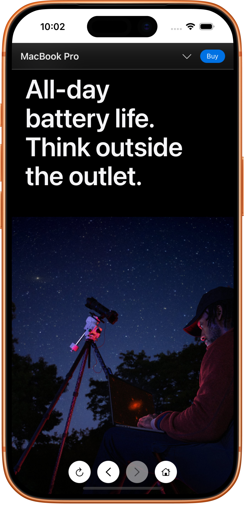

# SwiftUI WebView Examples

This project demonstrates two different approaches to integrating `WKWebView` inside SwiftUI.


Both examples include:

- [x] Load URL
- [x] Reload
- [x] Back / Forward navigation
- [x] Home button
- [x] Loading indicator
- [x] Navigation policy / state tracking


#### Screenshots:
<p align="start">
  
  &nbsp;&nbsp;&nbsp;
  
</p>


<br>
<br>
<br>


## 1️⃣ Coordinator-Based WebView

This approach uses `UIViewRepresentable` with a `Coordinator` to bridge `WKNavigationDelegate`.
<br>
The `Coordinator` handles loading state & navigation policy.

Structure:
```scala
ContentView()
 └── WebView: UIViewRepresentable
      └── Coordinator: WKNavigationDelegate
```


<br>
<br>
<br>


## 2️⃣ ViewModel-Based WebView

This approach uses a `WebViewModel` to manage `reload()`, `back()`, `forward()`, `home()`, and `load(_:)`
<br>
Also publishes: `isLoading`, `canGoBack`, and `canGoForward`

Structure:
```scala
ContentView()
 └── WebView
      └── ViewModel: WKNavigationDelegate
```
